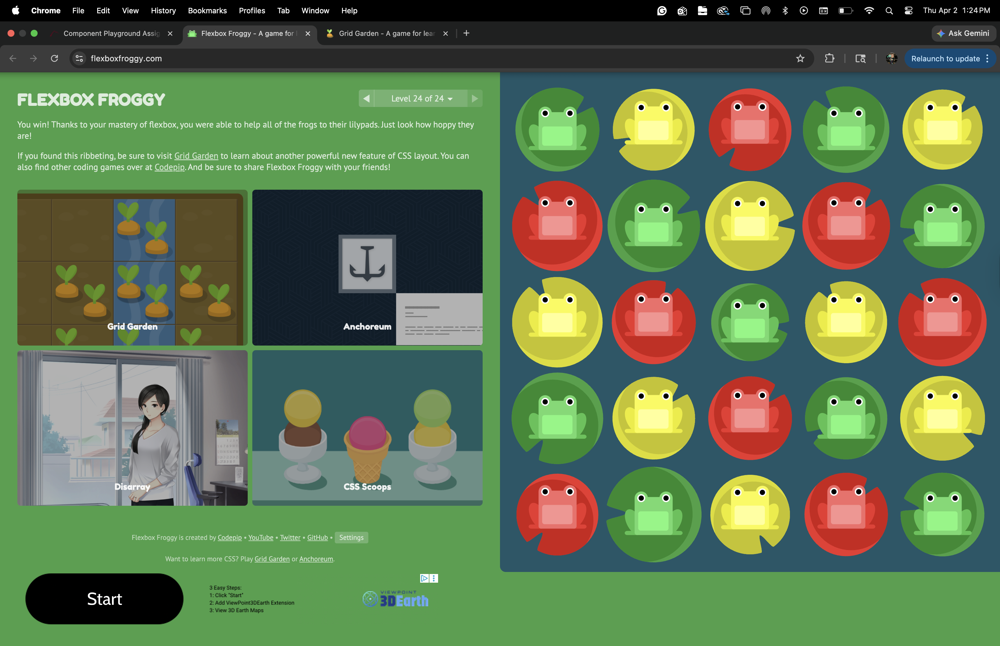
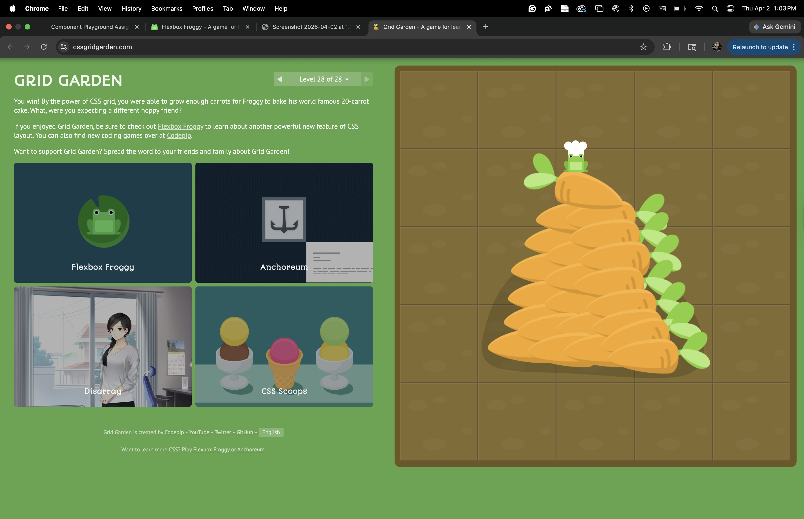
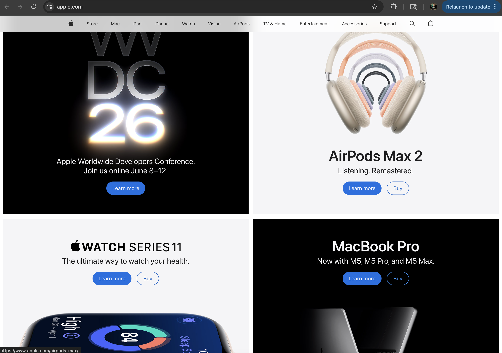

# Week's Assignment
 
## Flexbox Froggy - Completed (Level 24/24)

 
## Grid Garden - Completed (Level 28/28)

 
## Reflection
 
This weel went well! I chose to replicate apples grid design and I found it a lot easier to match the template almost spot on. The games really helped to memorize a lot of the commands too.
Here is the orginal screenshot that I took inspiration from. 

## Apple Website Grid

 
**How are you feeling about working with CSS Flexbox, CSS Grid, and component-based thinking?**
 
I am feeling pretty good about working with CSS Flexbox, CSS Grid, and component-based thinking. It's gotten a lot easier having done more work and learning with it. 